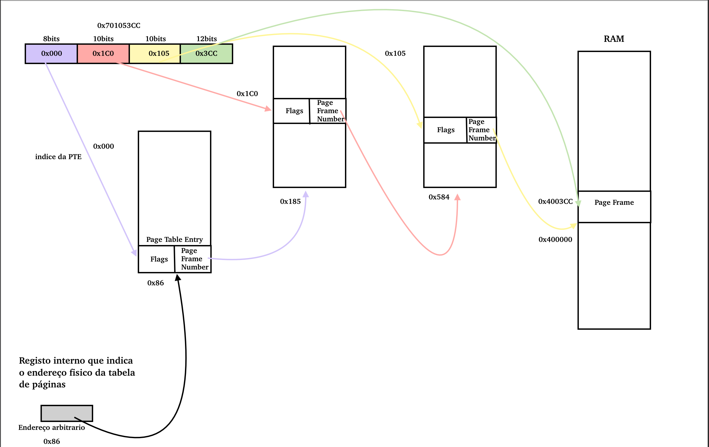

## a) Qual a dimensão de cada página e qual o número de bits de um endereço virtual?
 - Dimensão de cada página:
    - 4 bytes (PTE) * 1024 (Entradas na tabela) = 4KiB = 2^12
    - logo, offset = 12
- Número de bits de um endereço virtual:
    - tabela de primeiro nível: 2^8 = 256
    - tabela de segundo nível: 2^10 = 1024
    - tabela de terceiro nível: 2^10 = 1024
    - offset = 12
    - R.: 8 + 10 + 10 + 12 = <u>40 bits</u> => 2^40 = 1TiB

## b) Sabendo que o espaço de endereçamento físico é quatro vezes inferior ao espaço de endebreçamento virtual, qual é o número total de bits do espaço de endereçamento físico, e quantos bits para controlo sobram na PTE?
 - Número de bits do espaço de endereçamento físico:
    - 1/4 * 2^40 = 1/4 * 1024^4 = 256GiB = 2^38
    - R.: <u>38 bits</u>
- Número de bits para controlo que sobram na PTE:

    - Precisamos de descobrir quantos page frames temos. 
        - Sabemos que a pte tem 32 bits(4bytes)
        - Número de page frames  = espaço de endereçamento fisico / tamanho das paginas=2^38/ 2^12=2^26= 26 bits mais significativos do endereço de page frame

    - 32 bits(cada entrada da pte) - 26 bits de cima = 6 bits para controlo
    - <u>6 bits para controlo</u>
    

## c) Até quanto pode crescer o espaço de endereçamento virtual, mantendo-se o número de níveis apresentado para a MMU?
Mantendo o número de níveis apresentados para a MMU o espaço de endereçamento virtual pode crescer aumentando os bits necessários para o primeiro nível. Passando de uma tabela de 256(8 bits) entradas para uma tabela de 1024(10 bits) entradas, isto é, aumentávamos 2 bits no espaço de endereçamento virtual passando de 40 para 42 bits.

## d) Considere a tradução do endereço virtual 0x701053CC para o respetivo endereço físico localizado na página física que começa no endereço 0x400000. Estabeleça um endereço físico arbitrário para a base da tabela de primeiro nível, ficando as restantes tabelas envolvidas no processo de tradução em endereços físicos contíguos crescentes. Apresente a sequência de passos necessários para realizar a tradução do endereço virtual, indicando em detalhe:
o endereço físico arbitrário escolhido para a base da tabela de primeiro nível foi o 0x86.
### o endereço base de cada tabela de tradução utilizada
    Tabela 1 - 0x86
    Tabela 2 - 0x185
    Tabela 3 - 0x584
### o endereço de cada PTE envolvida na tradução
    Tabela 1 - 0x000
    Tabela 2 - 0x1C0
    Tabela 3 - 0x105
### os bits de endereço físico contidos em cada uma dessas PTE 
    -----
    
### o endereço físico final
    0x4003CC
    

## e) Comente a seguinte afirmação: “Nesta arquitetura, cada acesso lógico à memória, correspondente a uma operação de fetch, load ou store do CPU, implica sempre quatro acessos físicos à memória.”

Esta afirmação é verdadeira, pois ...
Portanto para conseguir chegar a localização final é preciso fazer 4 acessos à memória. Sendo uma penelização elevada ter que fazer 4 acessos a memoria só para fazer um acesso único e por isso as arquiteturas modernas tem o translation lookaside buffer que resolve este problema, pois é um cache de endereços de memória.